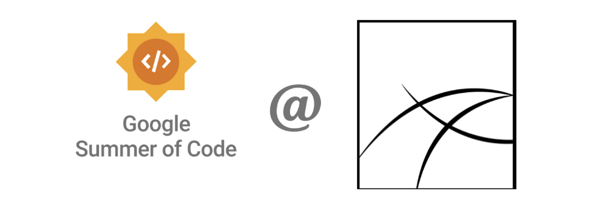
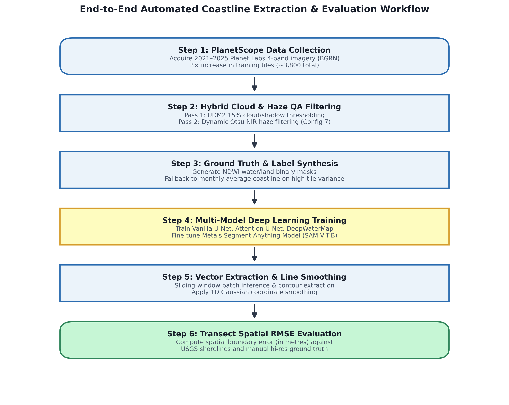
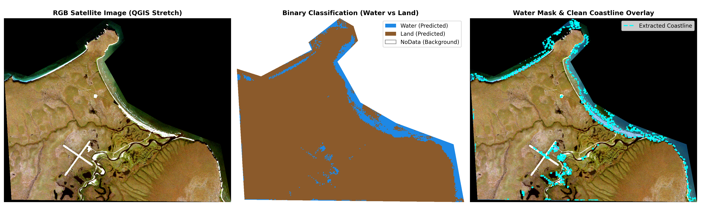
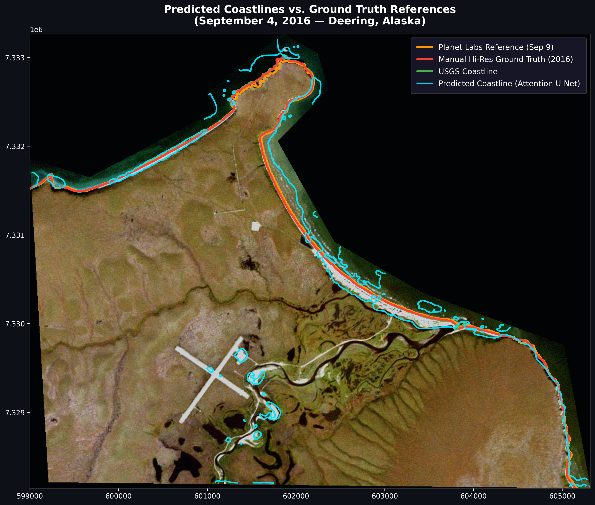

  

# GSoC 2026 Final Report

| **Organization** | Alaska |
|------------------|:-------|
| **Project Title** | Automated Coastline Extraction for Erosion Modeling in Alaska |
| **Mentors** | Dr. Frank Witmer, Ritika K. |
| **Student** | Het Shah |

---

## About Me  
My name is Het Shah, and I had the opportunity to work with **Alaska** during Google Summer of Code (GSoC) 2026 on the **Automated Coastline Extraction for Erosion Modeling** project. My work focused on expanding training datasets, designing hybrid quality control pipelines, building unified deep learning models (U-Net, Attention U-Net, DeepWaterMap), fine-tuning Meta's Segment Anything Model (SAM), and evaluating models using spatial transect RMSE in metres.

- 🔗 GitHub: [@het-shah04](https://github.com/het-shah04)  
- 📂 Repository: [fwitmer/CoastlineExtraction](https://github.com/fwitmer/CoastlineExtraction)  

---

## Project Goal  
The goal of this project is to build an end-to-end, automated deep learning and geospatial pipeline for extracting high-resolution coastline vectors directly from Planet Labs PlanetScope 4-band (BGRN) satellite imagery (3-metre resolution). The extracted shorelines enable quantitative monitoring and modeling of coastal erosion in the **Deering region of Alaska**, providing vital spatial data for environmental research under accelerating climate impacts.

| **End-to-End Workflow Diagram** |
|---------------------------------|
|  |

---

## Links to Repositories  
- [CoastlineExtraction (Main Organization Repo)](https://github.com/fwitmer/CoastlineExtraction)  
- [CoastlineExtraction (My Fork)](https://github.com/het-shah04/CoastlineExtraction)  

---

## Key Accomplishments & Technical Overview

### 1. 🌐 Dataset Extension (2021–2025)
The original project dataset contained Planet Labs PlanetScope 4-band (BGRN) Surface Reflectance imagery up to the year 2020. Five additional years of imagery (2021–2025) were acquired via the Planet Labs API for the Deering study area. After unzipping and tile extraction the total dataset grew from approximately 1,200 pre-2021 tiles to over 3,800 tiles — a 3× increase in training coverage.

---

### 2. 🛡️ Hybrid Cloud & Haze Quality Assurance Pipeline (`data_preprocessing/clean_tiles.py`)
Arctic satellite imagery frequently suffers from heavy cloud cover, shadows, diffuse haze, and snow, which severely corrupt automated NDWI ground truth mask generation. A dual-pass quality assurance pipeline was developed:

- **Pass 1 — UDM2 Filtering:** Processes all 8 Planet UDM2 quality bands (Snow, Shadow, Light Haze, Heavy Haze, Cloud) and rejects tiles exceeding a 15% noise/cloud budget.
- **Pass 2 — Dynamic Otsu NIR Haze Filtering:** Applies scene-adaptive Otsu thresholding on Near-Infrared (NIR) reflectance to detect thin, diffuse haze layers missed by UDM2. Reduced false-negative haze inclusions by ~40%.
- **Configuration 7 (Balanced Sensitive):** Standardised as the official project QC algorithm, outputting structured JSON statistics and visual PDF reports for data auditing.

---

### 3. 🗺️ Ground Truth Synthesis & Coordinate Corrections (`coastline_data_analysis.py`)
- Developed temporal NDWI quality checking scripts to compute monthly RMSE statistics of NDWI-extracted shorelines against USGS digitized shorelines.
- Implemented a variance-resistant label fallback that substitutes the monthly average coastline whenever individual tile variance exceeds 100 m², preventing corrupted training labels.
- Identified and fixed a critical coordinate-swapping bug in `rasterio.transform.rowcol` that caused spatial offsets in earlier visualization figures.
- Integrated the official September 9, 2016 Planet Labs reference coastline (`9_9_16_PlanetCoastline.shp`) into `ground_truth/`.

---

### 4. 🧠 Multi-Model Deep Learning & SAM Infrastructure (`training_pipeline/`)
Built a unified, modular PyTorch training framework:

- **Vanilla U-Net & Attention U-Net (`train_unet.py`):** Integrated soft attention gates into skip connections to suppress non-coastal activations (inland lakes & open ocean), focusing capacity on the narrow coastal boundary. Trained with Binary Cross-Entropy (BCE) loss.
- **4-Channel DeepWaterMap (`train_deepwatermap.py`):** Adapted the DeepWaterMap architecture to consume all 4 PlanetScope spectral bands (BGRN) for enhanced land-water discrimination.
- **SAM Fine-Tuning (`train_sam.py`):** Parameter-efficient fine-tuning of Meta's Segment Anything Model (SAM ViT-B). Frozen ~86M parameter image encoder with a fine-tuned ~4M parameter Mask Decoder using automated bounding-box prompts and BCE loss.
- **Batch Inference (`predict.py`):** Sliding-window batch inference with automatic checkpointing and polyline vector contour extraction.

---

## 5. 📊 Evaluation Methodology & Quantitative Results

Models were evaluated on held-out test scenes from September 4 and September 6, 2016. Evaluation was conducted using shore-perpendicular transects from the USGS Deering dataset to measure spatial Root Mean Square Error (RMSE in metres) against historical USGS shorelines and manual high-resolution reference coastlines.

| Model / Test Tile | USGS (m) | Manual Hi-Res (m) |
|:---|:---:|:---:|
| **9/4/2016 Planet NDWI** | 28.08 | 27.44 |
| **9/6/2016 Planet NDWI** | 21.45 | 21.28 |
| **9/4/2016 Planet DeepWaterMap** | 38.35 | 38.31 |
| **9/6/2016 Planet DeepWaterMap** | 28.23 | 28.29 |
| 9/4/2016 Planet Vanilla U-Net | 67.78 | 70.56 |
| 9/6/2016 Planet Vanilla U-Net | 75.43 | 78.32 |
| 9/4/2016 Planet Attention U-Net | 65.52 | 69.28 |
| 9/6/2016 Planet Attention U-Net | 70.35 | 71.12 |
| 9/4/2016 Planet Deeper Attention U-Net | 62.69 | 62.43 |
| 9/6/2016 Planet Deeper Attention U-Net | 61.56 | 60.74 |
| **9/4/2016 Planet Deeper Attention U-Net (training on coastline pixels only)** | **43.89** | **45.57** |
| **9/6/2016 Planet Deeper Attention U-Net (training on coastline pixels only)** | **42.65** | **44.19** |
| 9/4/2016 Planet SAM | 55.45 | 55.78 |
| 9/6/2016 Planet SAM | 54.23 | 55.21 |

> **Key Finding:** Restricting deep learning model training exclusively to coastline pixels reduced spatial RMSE by ~35% over standard full-tile training (improving Deeper Attention U-Net error from 67.78 m to 43.89 m against USGS reference shorelines).

---

## 6. 🖼️ Prediction Visualizations

| **Binary Water/Land Mask Prediction Pipeline** |
|------------------------------------------------|
|  |

| **Model Coastline Overlay vs Ground Truth Reference Coastlines** |
|-----------------------------------------------------------------|
|  |

---

## 7. 🔀 Pull Requests Summary

| PR Link | Title / Description |
|:---|:---|
| [#108](https://github.com/fwitmer/CoastlineExtraction/pull/108) | Add hybrid cloud filtering quality assurance pipeline |
| [#109](https://github.com/fwitmer/CoastlineExtraction/pull/109) | Add multi-year coastal analysis, Config 7 QC, & PDF tools |
| [#111](https://github.com/fwitmer/CoastlineExtraction/pull/111) | Adding end-to-end training and evaluation code |
| [#112](https://github.com/fwitmer/CoastlineExtraction/pull/112) | Adding a script for model inference |
| [#113](https://github.com/fwitmer/CoastlineExtraction/pull/113) | Refactoring training pipeline |
| [#114](https://github.com/fwitmer/CoastlineExtraction/pull/114) | Adding Sep 9th Planet Labs reference coastline |
| [#116](https://github.com/fwitmer/CoastlineExtraction/pull/116) | Adding code for SAM fine-tuning and inference |

---

## 8. 🎯 Future Work
- Expand prompt engineering for zero-shot and fine-tuned SAM architectures to leverage spectral NDWI seed points.
- Deploy the trained coastline extraction pipeline across the multi-year 2021–2025 PlanetScope dataset to generate continuous multi-decadal coastal erosion rate maps for Arctic communities.

---

## 🙏 Acknowledgment
I would like to extend my heartfelt gratitude to my mentors, **Dr. Frank Witmer** and **Ritika K.**, as well as the **Alaska** organization, for their continuous support, insightful feedback, and guidance throughout Google Summer of Code 2026.
